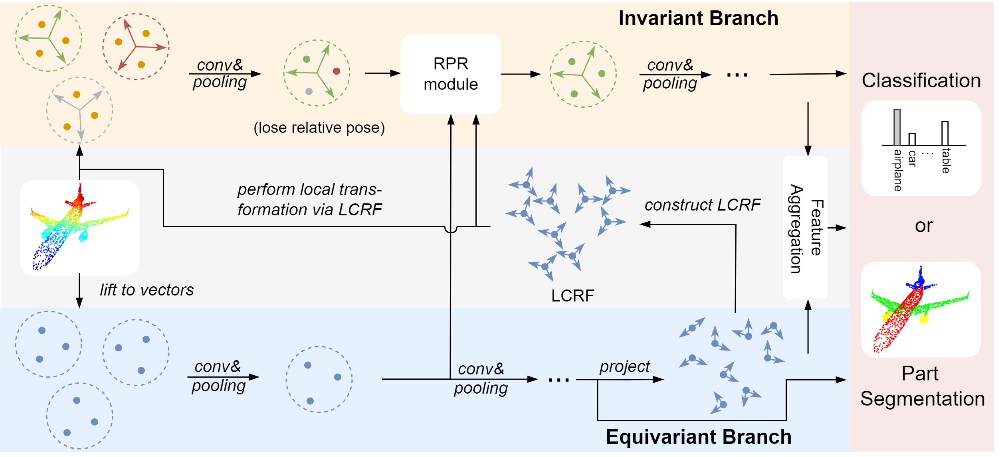

# [CVPR 2024] Local-consistent Transformation Learning for Rotation-invariant Point Cloud Analysis

By Yiyang Chen, Lunhao Duan, Shanshan Zhao, Changxing Ding and Dacheng Tao

This is the official implementation of "Local-consistent Transformation Learning for Rotation-invariant Point Cloud Analysis"
[[arXiv]](https://arxiv.org/abs/2403.11113)



## Requirements

* Python 3.7.0
* Pytorch 1.9.0
* CUDA 11.1
* Packages: numpy, pytorch3d, sklearn, h5py, tqdm
* 4 NVIDIA TITAN V GPUs
## Data

The ModelNet40 dataset will be automatically downloaded.

## Performance

Accuracy on ModelNet40 dataset under rotation: 
* Ours: <b>91.6%</b> (z/z, z/SO(3)), <b>91.5%</b> (SO(3)/SO(3))
* Ours*: <b>91.5%</b> (z/z, z/SO(3)), <b>91.7%</b> (SO(3)/SO(3))

`Ours` represents our original network. We further develop a lightweight
version by reducing the computational burden of our original network. 
`Ours*` represents the lightweight version.

## Classification on ModelNet40

#### Training
  ```
  python main_cls.py --exp_name=modelnet40_cls --rot=ROTATION 
  ```
   ```
  python main_cls_l.py --exp_name=modelnet40_cls --rot=ROTATION 
  ```
Here `ROTATION` should be chosen from `aligned`, `z` and `so3`. `main_cls.py` is the script for training 
the original network, while `main_cls_l.py` is for training the lightweight version.

#### Evaluation
  ```
  python main_cls.py --exp_name=modelnet40_cls --rot=ROTATION --eval=True --checkpoint=MODEL
  ```
Here `MODEL` should be chosen from `model`, `model_vn`, `model_fuse`, `model_1` and `model_2`.
`model_1` or `model_2` achieves the best performance.
  ```
  python main_cls_l.py --exp_name=modelnet40_cls --rot=ROTATION --eval=True --checkpoint=MODEL
  ```
Here `MODEL` should be chosen from `model`, `model_vn`, `model_1`.
`model_1` achieves the best peformance.

You can also test our pretrained model directly:
  ```
  python main_cls.py --exp_name=modelnet40_cls --rot=ROTATION --eval=True --model_path PATH
  ```
Here `PATH` can be set as `pretrained/model_1_z.t7` or `pretrained/model_1_so3.t7`.
  ```
  python main_cls_l.py --exp_name=modelnet40_cls --rot=ROTATION --eval=True --model_path PATH
  ```
Here `PATH` can be set as `pretrained_l/model_1_z.t7` or `pretrained_l/model_1_so3.t7`.

## Citation
If you find this repo useful, please cite:
  ```
  @article{chen2024local,
  title={Local-consistent Transformation Learning for Rotation-invariant Point Cloud Analysis},
  author={Chen, Yiyang and Duan, Lunhao and Zhao, Shanshan and Ding, Changxing and Tao, Dacheng},
  journal={arXiv preprint arXiv:2403.11113},
  year={2024}
}
  ```

## Acknowledgement

Our code borrows from:

- [DGCNN](https://github.com/WangYueFt/dgcnn)
- [DGCNN.pytorch](https://github.com/AnTao97/dgcnn.pytorch)
- [vnn-pc](https://github.com/FlyingGiraffe/vnn-pc/)
- [PaRI-Conv](https://github.com/GostInShell/PaRI-Conv)